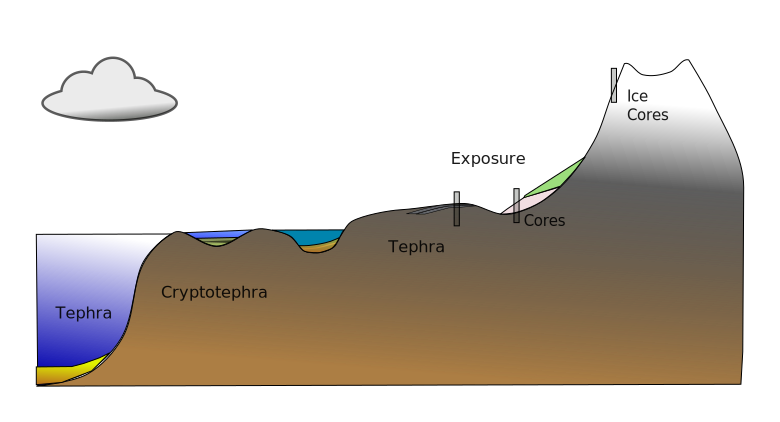
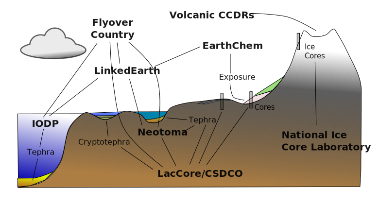
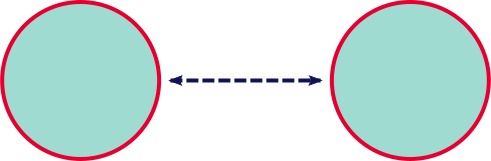
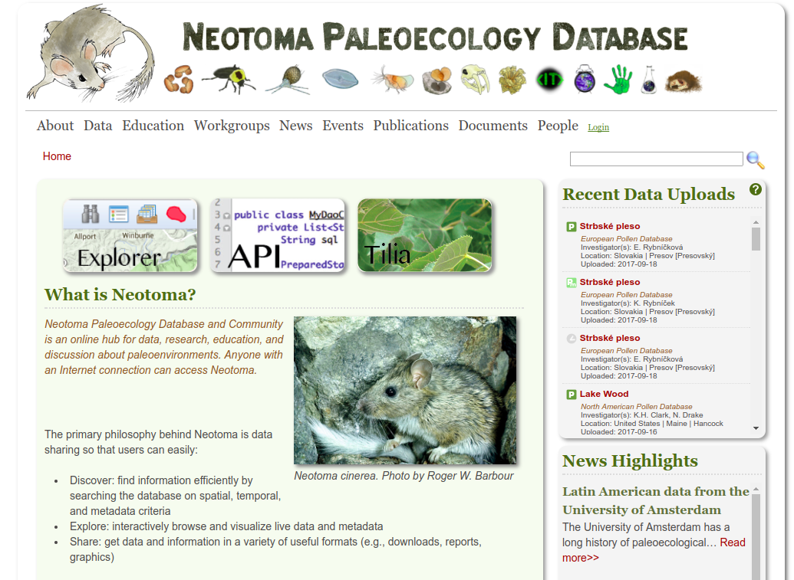
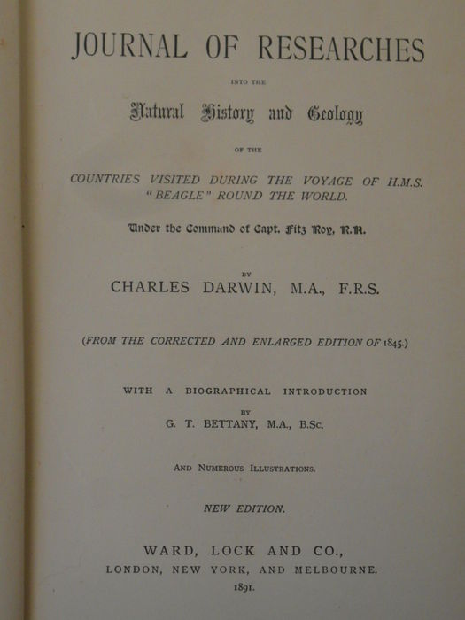

# Reproducibility and Open Science {data-background-image="images/12210424505_f13e8c0eda_o.png"} 

Open science & data sharing is a moral imperative within the sciences*

## Technical Challenges {data-background-color=#9fDBD1}

<figure>
  <figcaption>Where do I put my data / Where do I get my data?</figacption>
</figure>

## {data-background="images/Volcanic_Ash_Dunes.jpg"}

##  {data-background-color=#9fDBD1}



##  {data-background-color=#9fDBD1}



## Scientific Challenges {data-background-color=#ffC038}

<h3>Where do I put/get my data?<h3>

## {data-background-color=#ffC038}

<h3>Linking data resources becomes imperative.</h4>



## Technical Challenges {data-background-color=#9fDBD1}

<figure>
  <figcaption>How do we sustain data content?</figacption>
</figure>

## Technical Challenges {data-background-color=#9fDBD1}

<figure>
  <figcaption>Science is cultural.</figacption>
</figure>

## Technical Challenges {data-background-color=#ffC038}

## {data-background-color=#ffC038}

<figure>

# Neotoma and Community Resources

## Community Curated Data Resources {data-background-color=#9fDBD1}

Neotoma, Paleobiology Database, Paleofire Database, Geochron, Geochem, ePannda, iDigBio, GBIF . . .

## Neotoma and Community Resources {data-background-color=#9fDBD1}

From systems of record -> systems of engagement.

- Geoffrey Moore

## Neotoma as a Platform {data-background-color=#9fDBD1}

</img>

## Neotoma Paleoecological Database {data-background-color=#9fDBD1}


 					<br>

<br>

## Technical Challenges  {data-background-color=#9fDBD1}

<figure>
  <figcaption>How do we sustain data content?</figacption>
</figure>

## DeepDive Infrastructure  {data-background-color=#ffc038}

GeoDeepDive consists of a cyberinfrastructure to manage documents from scientific publishers and to apply Natural Language Processing in an effort to build rich data discovery tools that can leverage dark data in new ways.

## Adding New Data  {data-background-color=#ffc038}



## Mining Data with OCR & NLP  {data-background-color=#ffc038}

<table><tr><td>Article id</td><td>55b2ab84e138231cbdd6cdbd</td></tr>
<tr><td>Sentence id</td><td>87</td></tr>
<tr><td>Sentence verbatim</td><td>The specimen is significant in that it clearly shows the entire polyplated periproctal area and the ventral thecal plates adjacent to the brachioles.</td></tr>
<tr><td>Parts of Speech</td><td>{DT,NN,VBZ,JJ,IN,IN,PRP,RB,VBZ,DT,JJ,JJ,JJ,NN,CC,DT,JJ,JJ,NNS,JJ,TO,DT,NNS,.}	</td></tr>
<tr><td>Reserved Terms</td><td>{O,O,O,O,O,O,O,O,O,O,O,O,O,O,O,O,O,O,O,O,O,O,O,O}	</td></tr>
<tr><td>Parts of Speech</td><td>{det,nsubj,cop,"",mark,mark,nsubj,advmod,advcl,det,amod,amod,amod,nsubj,cc,det,amod,amod,conj:and,xcomp,case,det,nmod:to,""}</td></tr>
<tr><td>Word modified</td><td>{2,4,4,0,9,9,9,9,4,14,14,14,14,20,14,19,19,19,14,9,23,23,20,0}</td></tr></table>

## Building Regex {data-background-color=#ffc038}

We need to match a range of coordinate indicators:

<pre>45°56’ W, 45°56’N, 45◦56 W, 45◦56’N, -45°56’, 123.5° E, -123°23’12“</pre>

```r
library(stringr)

dms_regex <- "[\\{,]([-]?[1]?[0-9]{1,2}?)(?:(?:,[°◦o],)|(?:[O])|(?:,`{2},))([1]?[0-9]{1,2}(?:.[0-9]*)),[′'`]?[,]?([[0-9]{0,2}]?)[\"]?[,]?([NESWnesw]?),"
dd_regex <- "[\\{,][-]?[1]?[0-9]{1,2}\\.[0-9]{1,}[,]?[NESWnesw],"

degmin <- stringr::str_match_all(nlp$word, dms_regex)
decdeg <- stringr::str_match_all(nlp$word, dd_regex)
```

## Results {data-background-color=#ffc038}

  <iframe src="http://www.goring.org/resources/empty-spaces.html" style="width:800px;height:500px;"></iframe>
  
  <a href="http://www.goring.org/resources/empty-spaces.html">http://www.goring.org/resources/empty-spaces.html</a>

## Results {data-background-color=#ffc038}

<div>
```{r echo=FALSE, message=FALSE, warning=FALSE}

library(dplyr)
library(leaflet)

coordinates <- readr::read_csv('deepdive.csv')[,-1]

leaflet(coordinates) %>% 
  addProviderTiles(providers$CartoDB.Positron) %>% 
  addCircleMarkers(popup = paste0('<b>', coordinates$title, '</b><br>',
                                  '<a href=http://dx.doi.org/',
                                  coordinates$title,'>Publication Link</a><br>',
                                  '<b>Sentence:</b><br>',
                                  '<small>',gsub(',', ' ', coordinates$sentence),
                                  '</small>'),
                   color = ~matched)
```
</div>

## Scientific Challenge  {data-background-color=#ffc038}

Preserve primary data, support multiple annotation systems.

* W3C PROV, W3C Annotation

## Data Re-analysis  {data-background-color=#ffc038}

</img>

## Data Re-analysis  {data-background-color=#ffc038}

  <iframe src="http://apps.neotomadb.org/explorer/?datasetid=7" style="width:800px;height:500px;"></iframe>

# Graph Solutions

## Annotation Engines


## NSF Awards

# Conclusion

# Thank You